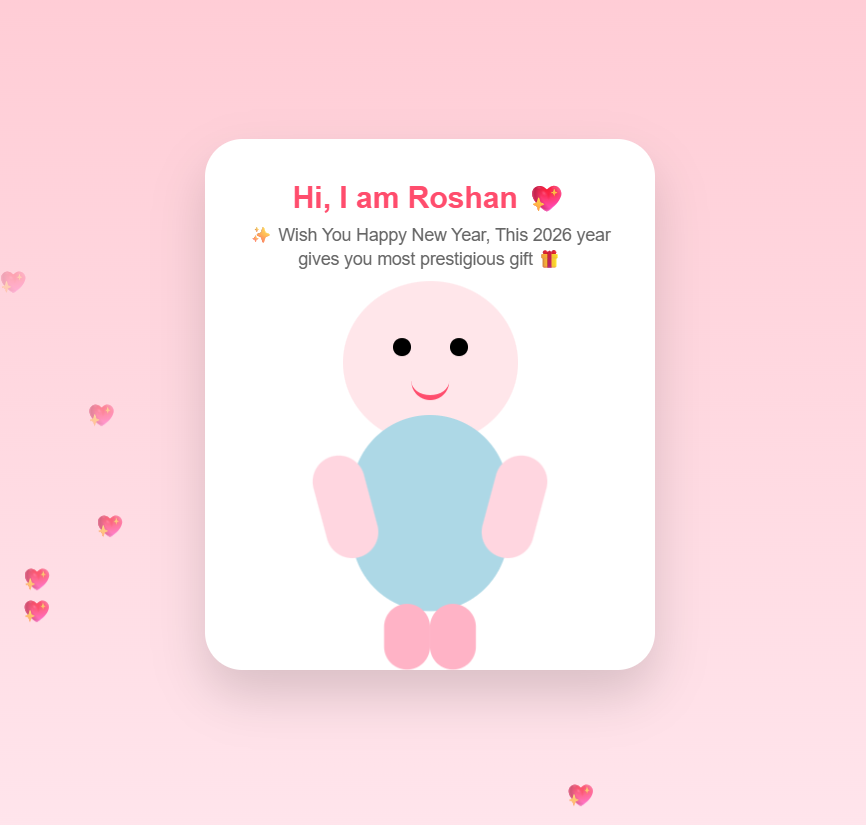

# 💖 Bubu Love Card (Animated & Responsive)

A cute, animated **Bubu Love Card** built using **HTML, CSS, and JavaScript**.  
This project is fully responsive and works perfectly on **mobile, tablet, and desktop** devices.

It features a full-body animated **Bubu character**, floating hearts, smooth animations, and a clean card-style UI — perfect for gifting or sharing with someone special 💕

---

## Features

- Full-body **Bubu character** (CSS-based)
- Floating heart animations
- Blinking eyes & breathing effect
- Fully responsive (Mobile / Tablet / Desktop)
- Lightweight (No images, no libraries)
- Works in all modern browsers

---

## Technologies Used

- **HTML5**
- **CSS3** (Animations & Media Queries)
- **JavaScript** (Heart animation logic)

---

## Screenshots

  
  

## How to Run the Project

- Download or clone this repository
- Open the index.html file in any web browser
- Enjoy the animated Bubu Love Card 💖
You don't need to do any setup.

## Deploy on GitHub Pages

- Push this project to a GitHub repository
- Go to Repository → Settings → Pages
- Select:
- - Branch: main
- - Folder: /root
- Save and get your live website link

## Customization Ideas

-  Add a New Year / Birthday wish
-  Add background music
-  Add hug or kiss animation
-  Create multiple pages with a Next button
-  Convert the project into a PWA

## Made With Love

#### Built with ❤️ using pure HTML, CSS & JavaScript. A fun project for learning animations and creating cute digital cards.

## Author

### Roshan Kumar Sharma, Software Engineer.  
You can reach out via: -
- Email: roshan.amlai96@gmail.com 
- LinkedIn: https://www.linkedin.com/in/RoshanSharma7/
- Twitter: https://www.twitter.com/imroshansharma7
- Portfolio: https://roshansharma7.github.io/Roshan.github.io/

---

### Notes
If you found this helpful, please follow me on all platforms.
